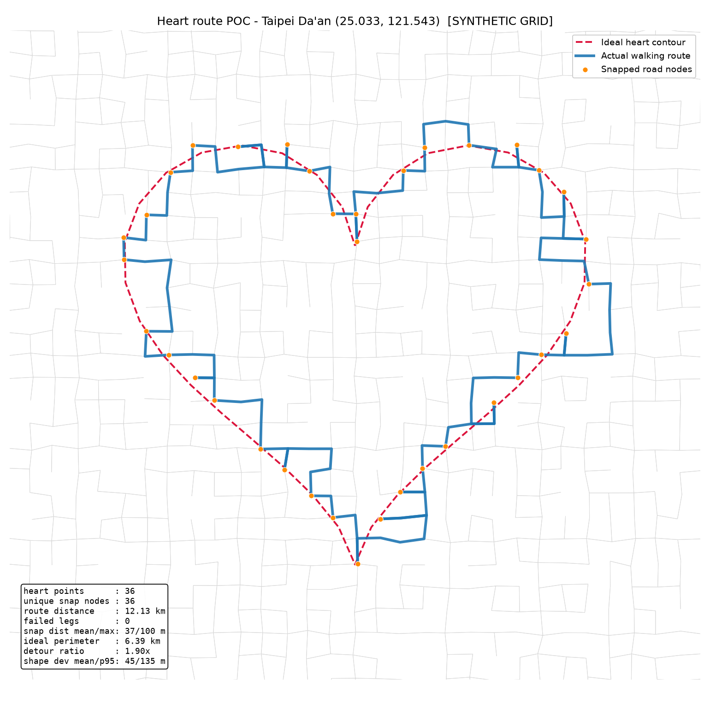

# POC 1 — Heart Route on Real Streets (Taipei)

A deliberately small proof of concept for one question:

> Can an ideal heart shape be turned into a real walkable route on Taipei
> streets that still visually reads as a heart?

**Answer: yes.** A 40-point heart placed over Da'an District snaps onto the
walking network and produces a closed 9.29 km loop that is unmistakably a
heart. No frontend, no optimiser, no AI — just geometry, OpenStreetMap and
shortest paths.



## Running it

```bash
pip install -r requirements.txt
python heart_route_poc.py
```

Outputs `heart_route_poc.png` (the comparison plot) and `ideal_heart.png`
(the Step 1 sanity check). The first run downloads the street network, which
takes a minute or two; it is cached in `_walk_<lat>_<lon>_<size>.osm` and reused after that.
Delete that file to force a fresh download.

Useful flags:

```bash
python heart_route_poc.py --points 48          # denser contour
python heart_route_poc.py --width-m 1500       # smaller heart
python heart_route_poc.py --lat 25.04 --lon 121.55
python heart_route_poc.py --allow-dead-ends    # reproduce the untuned baseline
```

## How it works

| Step | Function | What it does |
| --- | --- | --- |
| 1 | `generate_heart_points()` | Samples the parametric heart curve, normalised to width 1.0 |
| 2 | `transform_shape_to_map()` | Scales to 2 km wide and centres it on Da'an, in UTM metres |
| 3 | `download_walk_graph()` | Pulls the walkable network from OSM and projects it to EPSG:32651 |
| 4 | `snap_points_to_graph()` | Snaps each contour point to a nearby junction |
| 5 | `build_route()` | Shortest-paths between consecutive targets and closes the loop |
| 6 | `plot_result()` | Draws network, ideal contour, snap targets and actual route |

All geometry happens in a **projected CRS (UTM zone 51N), not in degrees**. At
Taipei's latitude a degree of longitude is only ~0.906 of a degree of latitude,
so offsetting in raw degrees would squash the heart horizontally by about 10%.

### Note on the network download

The normal path is osmnx's Overpass query. This POC was developed in a sandbox
where every Overpass mirror was blocked, so `download_walk_graph()` falls back
to `osm_api_fallback.py`, which tiles the official OSM Map API (25 tiles for a
4 km × 4 km box, working around that API's 50,000-node-per-request cap) and
writes a minimal `.osm` file for osmnx to read. If Overpass is reachable on your
machine, the fallback never runs. The fallback reimplements osmnx's `walk`
network filter on parsed tags so both paths yield the same kind of graph.

## Results

```
heart sample points      : 40
unique snapped nodes     : 40
total route distance     : 9.29 km
failed segments          : 0
snap distance mean/max   : 28 m / 63 m
ideal contour perimeter  : 6.37 km
detour ratio vs ideal    : 1.46x
backtracked edges        : 13 of 272 (out-and-back spurs)
```

## What we changed and why

The very first run already produced a recognisable heart (9.51 km, 24
backtracked edges), so no rescue was needed. But the plot showed short
out-and-back spurs, mostly at the sharp cusps. Investigating:

- **5 of 40 snap targets were degree-1 nodes** — dead ends on footway stubs,
  service alleys and one flight of steps. A dead end can only be left the way it
  was entered, so each one forces a visible spur.
- 6 of the 9 worst legs (detour ratio > 1.5) touched a node of degree ≤ 2.
- Duplicate snapping was *not* the culprit: only 3 of 40 points shared a node,
  and de-duplicating alone changed the route length not at all.
- Point count behaves non-monotonically. 32 points scored *worse* than 28 or 40
  (1.80× vs 1.49×) because one unlucky sample landed on a bad node — evidence
  that quality is driven by individual snap targets, not contour density.

Two small adjustments followed, both in `snap_points_to_graph()`:

1. **Exclude dead ends** (`min_degree=3`) from the snap candidate pool.
2. **Require unique snap targets**, so no contour sample is silently dropped.

| Variant | Route | Detour ratio | Backtracked edges |
| --- | --- | --- | --- |
| Baseline (40 pts) | 9.51 km | 1.49× | 24 |
| + unique snapping | 9.51 km | 1.49× | 22 |
| + dead-end exclusion | **9.29 km** | **1.46×** | **13** |

Backtracking almost halved while mean snap distance rose only 27 m → 28 m.

## Findings

**Biggest failure mode: sharp concave features.** The cleft between the lobes
and the bottom tip are where the route still departs visibly from the ideal.
Two causes compound there. First, sampling `t` uniformly on `[0, 2π)` bunches
points near the cusps and thins them along the flanks (visible in
`ideal_heart.png`), so the cusps demand the most street-level precision exactly
where the grid can least supply it. Second, Taipei's block structure has no
street that turns a ~40° corner, so the network answers a sharp cusp with a
staircase or a spur.

The generic straight flanks are near-perfect; the shape's information content
sits in the cusps, and that is what the grid erodes.

> **POC 2–10 are done** — see [README_POC2.md](README_POC2.md),
> [README_POC3.md](README_POC3.md), [README_POC4.md](README_POC4.md) and
> [README_POC5.md](README_POC5.md) and [README_POC6.md](README_POC6.md) and
> [README_POC7.md](README_POC7.md) and
> [README_POC8.md](README_POC8.md) and
> [README_POC9.md](README_POC9.md) and [README_POC10.md](README_POC10.md).
> Deferred work is in [BACKLOG.md](BACKLOG.md).
>
> **POC 10 changed the target mode to cycling.** Everything before it was
> measured on the walking network, and the walking numbers are kept as a
> comparison rather than deleted.
>
> **POC 2** — see [README_POC2.md](README_POC2.md). It implements the
> recommendation below and beats POC 1 on every metric (8.80 km, detour 1.38×,
> 4 backtracked edges, chamfer 23.9 m). Two caveats worth reading there: a
> length-only DP cost made shape fidelity *worse*, and the arc-length
> resampling suggested below is actively harmful on its own.

## Recommendation for POC 2

Replace greedy per-point snapping with a **candidate set + dynamic program over
the whole contour**. Concretely:

1. For each contour point, keep the *k* nearest junctions (k ≈ 10) rather than
   committing to the single nearest.
2. Score a choice by both snap error and the routing cost to the previous
   point's candidate — a node 60 m off the contour that lies on a through street
   usually beats one 20 m off that needs a 300 m detour.
3. Run Viterbi/DP over the ordered candidates to pick the globally cheapest
   assignment, with one pass per starting candidate to close the loop.

This is map-matching, essentially, and it directly targets the failure mode: it
lets the algorithm trade a little snap accuracy for a lot of shape fidelity —
the trade greedy snapping cannot make. Two cheaper wins worth folding in:
**resample the contour by arc length** so points spread evenly instead of
clustering at the cusps, and **snap to nearest edge rather than nearest node**,
interpolating a point along the segment.

## Scope

Intentionally excluded: AI/LLM integration, image or text to shape, automatic
location search, route optimisation, frontend, database, APIs, auth.
