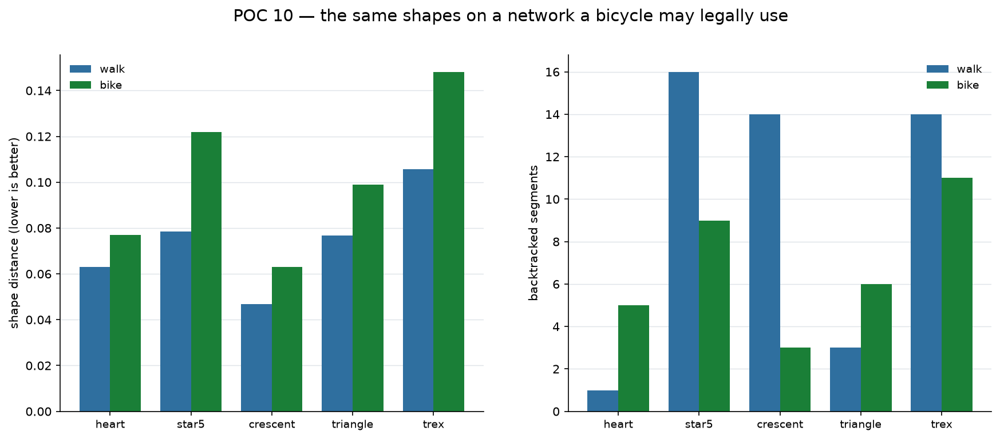

# POC 10 — Re-baselining on a network a bicycle can use

The goal changed: cycling routes, not walking ones. POCs 1–9 were built on the
walking network the original brief specified (`network_type="walk"`), so the
question was not "filter differently" but **which of nine POCs' numbers survive.**

## The walking routes were not rideable

| shape | route | unrideable | **dismounts** |
| --- | ---: | ---: | ---: |
| heart | 8.1 km | 22% | **12** |
| star5 | 9.5 km | 25% | **18** |
| crescent | 11.9 km | 25% | **22** |
| triangle | 7.7 km | 58% | **27** |

31% of total length, and 12–27 places per loop where you would have to get off.
The percentage is the less useful number: a closed loop with **one** impassable
segment is a broken shape.

Three separate faults, not one:

1. **Included what a bicycle may not use** — `footway` alone was 29.7% of route
   length, plus steps, corridors and pedestrian zones.
2. **Excluded what it most needs** — my walk filter listed `cycleway` among the
   excluded substrings, so the cached network contained **zero cycleways**.
   Taipei's riverside bike paths were entirely absent.
3. **Wrong traversal model** — the matcher ran `bidirectional=True`, with my own
   comment reading "pedestrians ignore one-way restrictions". The data had
   **8,127 ways tagged `oneway`** and 3,723 tagged `bicycle`. Both were there
   all along; neither was used.

## What survived, and what had to be re-measured

**Survived — everything that never touched a map:** the shape metric, the ~0.10
perceptual threshold, the tilt and feature findings from three raters, the
matcher, the two-stage search, the shape library, and **`n_min`** — which is a
property of a shape, not of a city.

**Re-measured — every network-derived constant:** characteristic scale, detour
ratio, and all shape scores.

| | walk | bike | ratio |
| --- | ---: | ---: | ---: |
| network length | 6,221 km | 3,480 km | 0.56 |
| nodes | 51,971 | 23,554 | 0.45 |
| median junction spacing on a route | 23 m | 40 m | **1.75** |
| detour ratio | 1.25 | 1.26 | 1.01 |



## A prediction of mine that was wrong

I predicted that respecting one-way restrictions would make concave shapes
**unroutable**, since POC 6 measured the star needing 20 backtracked segments
and a cyclist cannot ride back up a one-way street.

**All five shapes remained routable.** Backtracking went *down* rather than up
(star 20 → 9, crescent 14 → 3), because the bike network's edges are mostly
two-way roads rather than the one-way alleys and footways the walking matcher
was threading. The constraint I feared removed the behaviour instead of blocking
it.

## And a criticism of my own earlier method

POC 7 derived the street scale of 160 m as the **argmin of a contour-resolution
sweep**. Running the same sweep on both networks:

| | spread across the sweep | verdict |
| --- | ---: | --- |
| walk | 0.010 | flat; argmin is noise |
| bike | 0.047 | flat; argmin is noise |

Both spans sit below the 0.10 at which a person sees any difference — which POC
8 had already established for a different reason and I did not carry over.
**So `s = 160 m` is an empirical fitting constant, not a measured quantity**, and
POC 8 and POC 9 both rest on it.

Junction spacing *is* robustly measurable (23 m walking, 40 m cycling) but is a
different quantity — the 160 m is about seven times it. So rather than pretend
to measure `s` for cycling, it is **transferred**: 160 × 1.75, the junction
spacing ratio.

## The transfer earns its keep out of sample

A transferred constant is only worth having if it predicts something it was not
fitted to. It says which shapes can clear the 0.10 threshold as 2 km cycling
routes — before any of them were fitted:

| shape | predicted | measured | |
| --- | --- | ---: | :---: |
| heart | fits | 0.077 | ✓ |
| crescent | fits | 0.063 | ✓ |
| triangle | fits | 0.099 | ✓ |
| star5 | **too much detail** | 0.122 | ✓ |
| trex | **too much detail** | 0.148 | ✓ |

**5 of 5.** The feasibility formula transferred to a network it had never seen.

## What it costs to ride instead of walk

```
D_min = n_min × s(mode) × detour(mode)
```

| shape | walking | **cycling** |
| --- | ---: | ---: |
| heart · crescent · triangle | 2.4 km | **4.2 km** |
| star5 | 7.2 km | **12.7 km** |
| trex | 18.4 km | **32.5 km** |

About 1.75× across the board, since only `s` changes. A dinosaur is now a 32 km
ride — beyond a casual outing, and the page says so before drawing anything.

**Page updated with a mode toggle, cycling by default:**
https://claude.ai/code/artifact/33e0ab38-6982-49f2-bc0b-95a2f789115c

## Limits

- `s` for cycling is transferred, not measured. The out-of-sample result
  supports the transfer but does not make it a measurement.
- One city. The junction-spacing ratio between modes is a Taipei number.
- Shape scores are one placement search per shape at 2 km; POC 6's walking
  numbers came from the same procedure, so the comparison is like for like, but
  neither is a distribution.
- The strict filter admits `bicycle=permissive` ways, which can be withdrawn.
- Taiwan permits cycling on a pavement only where signage allows it; the filter
  encodes that as "excluded unless `bicycle` says otherwise", which is the right
  default but will differ by jurisdiction.

## Running it

```bash
python poc10_bike.py     # downloads the bike network on first run, ~9 min
```

`download_walk_graph(..., mode="bike")` and `plan(shape, km, mode="bike")` are
the mode-aware entry points. The walking path is unchanged and still passes.
