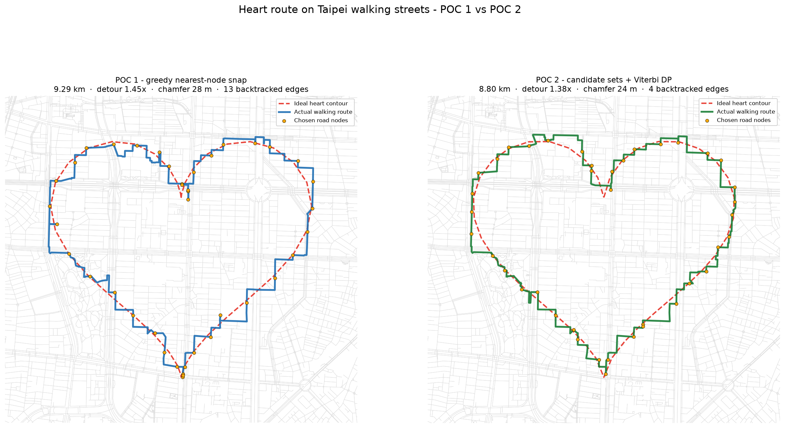

# POC 2 — Shape-aware route matching

POC 1 answered "can this work at all?" — yes. POC 2 answers "can the shape
fidelity be improved algorithmically?" — also yes, on every metric at once.



| metric | POC 1 | POC 2 | change |
| --- | ---: | ---: | ---: |
| route distance | 9.29 km | **8.80 km** | −5% |
| detour ratio vs ideal | 1.45× | **1.38×** | −0.07 |
| backtracked edges (spurs) | 13 | **4** | −69% |
| shape chamfer | 27.9 m | **23.9 m** | −14% |
| coverage mean / p95 | 23 / 61 m | **21 / 63 m** | − |
| stray mean / p95 | 32 / 88 m | **27 / 81 m** | −16% |

Runtime: ~3 s on top of the network load (3,980 candidate-pair costs).

## Running it

```bash
pip install -r requirements.txt
python heart_route_poc2.py
```

Outputs `heart_route_poc2.png` and `poc1_vs_poc2.png`. It runs *both* POCs on
the same graph so the comparison is apples-to-apples. Flags: `--candidates`,
`--snap-weight`, `--deviation-weight`, `--points`, `--width-m`, `--lat/--lon`.

## What changed

POC 1 snapped each contour point to its own nearest junction, independently of
every other point. That made the one trade that matters impossible: *a junction
60 m off the contour but on a through street beats one 20 m off that needs a
300 m detour.* Three changes:

**1. Arc-length resampling** (`resample_by_arclength`). The parametric heart
moves fastest along the flanks and slowest at the cusps, so uniform `t` piles
samples into the cleft and bottom tip and thins the flanks. Resampling at equal
arc length spreads them evenly.

**2. Candidate sets** (`build_candidate_sets`). Keep the *k* = 10 nearest
junctions per contour point instead of committing to the nearest. Dead ends
stay excluded, for the reason POC 1 established.

**3. Viterbi DP over the closed loop** (`viterbi_closed_loop`). Choose one
candidate per point to minimise a global cost, rather than 40 local decisions.
The route is a *cycle*, so the last point's choice depends on where the chain
started; the first point is pinned to each of its candidates in turn and the
cheapest complete loop wins — k passes, exact rather than clever.

### The cost function is where the work is

```
total = snap_weight · Σ snap_error  +  Σ [ excess_detour + deviation_weight · path_deviation ]
```

All terms in metres. `excess_detour = max(0, path_length − ideal_gap)` charges
only for being *longer than geometrically necessary*. `path_deviation` is the
mean distance from the candidate path to the ideal curve.

That last term is the crux, and it was not in my POC 1 recommendation. Path
*length* is blind to *where* a path goes, so a length-only cost rewards cutting
the corner off a curve — the shortcut is shorter and nothing charges for
leaving the shape. See below.

## What we got wrong on the way

Two findings contradicted the POC 1 write-up. Both are the reason this POC
existed, so they are worth recording rather than quietly fixing.

**A length-only DP makes the shape worse.** The first working version optimised
snap error plus detour, exactly as POC 1 recommended. It improved every
efficiency metric and *regressed shape fidelity*:

| variant | km | detour | backtracked | chamfer |
| --- | ---: | ---: | ---: | ---: |
| POC 1 greedy | 9.29 | 1.45× | 13 | 27.9 m |
| DP, length-only cost | 8.40 | 1.32× | 4 | **35.8 m** ← worse |
| DP, + deviation term | 8.80 | 1.38× | 4 | **23.9 m** |

The DP was spending shape accuracy to buy shorter paths, because nothing in the
cost function knew what the shape was. Adding `path_deviation` fixed it, at the
cost of ~0.4 km of route length. Sweeping the weight confirms a genuine
trade-off rather than a free lunch: pushing `deviation_weight` to 40 gets
chamfer down to 22.8 m but backtracking back up to 18.

**Arc-length resampling alone is harmful.** POC 1 recommended it as a "cheap
win". Measured on its own, with greedy snapping, it is worse than uniform `t`
on every metric (chamfer 29.6 vs 27.9, backtracking 25 vs 13). Clustering
samples at the cusps turns out to *help* greedy snapping pin the hardest
features. It only becomes a win once the DP and the deviation term exist to
exploit the even spacing — 24.7 m vs 26.8 m chamfer in the final configuration.
Two changes that each looked sensible in isolation only paid off together.

**A measurement bug, caught mid-run.** The first comparison scored each variant
against its own 40-point sample polygon. Since the two variants sample the curve
differently, they were being graded against different targets. Both are now
scored against one densely sampled reference curve (`dense_reference`).

## Tuning

Defaults are `k=10`, `snap_weight=1.0`, `deviation_weight=10.0`, picked from a
sweep. Results plateau around there: `k=20` buys ~1 m of chamfer for 2× the
runtime and a longer route. The candidate radius (260 m) never binds — every
contour point has 10 junctions within ~70 m in this part of Taipei.

## Does it generalise?

Same code and same weights, run over Zhongshan (25.0525, 121.5200), a location
not used for any tuning:

| metric | POC 1 | POC 2 |
| --- | ---: | ---: |
| route distance | 9.39 km | 8.76 km |
| detour ratio | 1.47× | 1.37× |
| backtracked edges | 18 | 7 |
| shape chamfer | 30.5 m | 26.2 m |

Same direction, same rough magnitude on all four. The gain is not an artifact
of the Da'an grid.

## Remaining failure modes

1. **Cusps are still the hard part.** The cleft and bottom tip are where the
   route still visibly departs from the ideal. No street turns a 40° corner;
   the network answers a cusp with a staircase. This is a property of the
   grid, not of the algorithm, and no amount of DP will remove it — only
   choosing a *location* whose streets suit the shape will.
2. **Deviation is measured against the whole curve**, not the local segment, so
   a path could in principle hug the wrong part of the contour and score well.
   The heart's two branches come closest at the cleft, which is exactly where
   the risk is highest. Not observed in these runs, but it is unguarded.
3. **Still node-snapping, not edge-snapping.** A contour point mid-block gets
   pulled to a junction. Interpolating a virtual node along the nearest edge
   would remove that quantisation.
4. **Fixed k.** Sparse areas (parks, riversides) may have no good candidate
   within reach, and a radius-based or adaptive k would handle that better than
   a constant.

## Recommendation for POC 3

The algorithm is now good enough that **location choice dominates it**. POC 2
improved chamfer by 4 m; moving the heart to a better-suited street grid is
plausibly worth several times that, and it is the last purely-geometric lever
before the product questions (text/image → shape) start.

Concretely: score a grid of candidate centres and rotations over a city-scale
network by running the POC 2 pipeline at coarse resolution (10–15 contour
points, k=5), then re-run at full resolution on the best few. The `chamfer_m`
metric already built here is the objective function. That also finally answers
the question POC 1 deferred — *where* in Taipei should the heart go — and it
naturally extends to picking a size and orientation, not just a centre.
