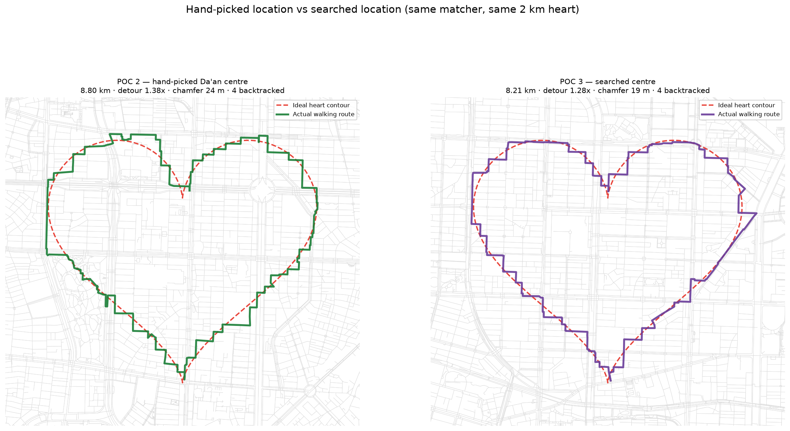
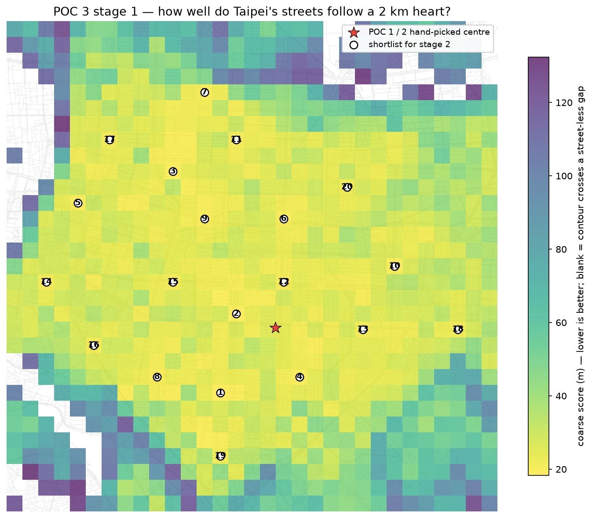
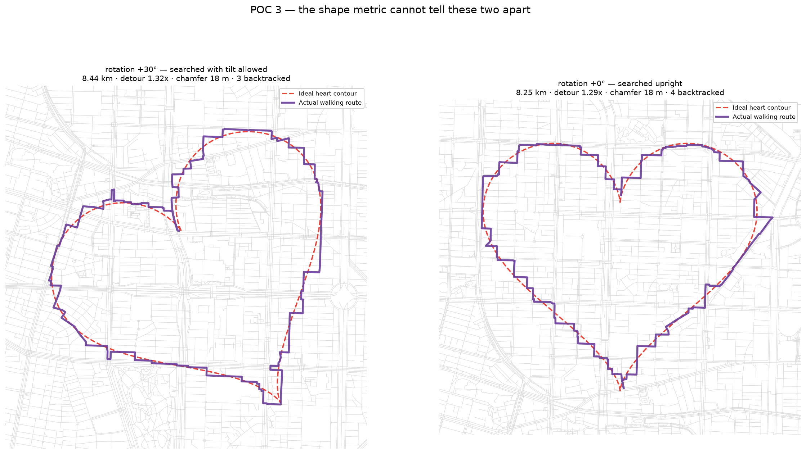

# POC 3 — Automatic location search

POC 2 ended on a measurement: better routing bought 4 m of shape accuracy, and
what remained was dominated by whether the local grid suited the shape at all.
No cleverness in the matcher fixes a cusp with no street near it. So:

> Given a city, **where** should the heart go?

**Answer: location matters more than the matcher did.** Searching 961
placements across a 9 × 9 km box of Taipei beat the hand-picked Da'an centre on
every metric, using the identical matcher and the identical 2 km heart.



| metric | hand-picked (POC 2) | searched (POC 3) | change |
| --- | ---: | ---: | ---: |
| shape chamfer | 23.9 m | **18.8 m** | −22% |
| coverage mean | 20.6 m | **16.0 m** | −22% |
| stray mean | 27.3 m | **21.6 m** | −21% |
| route distance | 8.80 km | **8.21 km** | −7% |
| detour ratio | 1.38× | **1.28×** | −7% |
| backtracked edges | 4 | 4 | — |

Winning location: **25.0544, 121.5378**. For scale, POC 2's entire algorithmic
overhaul bought 4.0 m of chamfer; moving the heart 2.4 km north bought 5.1 m.

## Running it

```bash
pip install -r requirements.txt
python heart_route_poc3.py
```

The first run downloads a 9 × 9 km network as 132 tiles (~9 minutes, cached
afterwards as `_walk_25.0400_121.5400_4500m.osm`). The search itself is ~4 s
for stage 1 plus ~5 s per stage-2 refinement. Outputs `poc3_search_map.png`,
`poc3_best_route.png`, `poc3_top_routes.png`.

```bash
python heart_route_poc3.py --grid-step-m 100      # finer grid
python heart_route_poc3.py --rotations -30,0,30   # allow tilt (see below)
python heart_route_poc3.py --refine 6             # fewer stage-2 fits
```

## How the search works

Two stages, because 961 placements × a 5-second fit is not a search.

**Stage 1 — coarse (4 s for 961 placements).** Build one k-d tree over points
sampled every 15 m along every edge (494k points), then ask of each placement:
how far is the ideal contour from *any* pavement? It knows nothing about
connectivity — only "is there street along this curve?".

```
score = mean distance to nearest street + 0.5 × 95th percentile
```

The percentile term separates a placement uniformly 30 m off (fine, the matcher
absorbs it) from one perfect for three quarters of the loop and 200 m off along
a riverbank. The mean alone rates those alike; the shape does not. Placements
where any part of the contour is >250 m from a street are rejected outright.

Sampling *edges* rather than nodes matters: Taipei junctions sit 100–200 m
apart, so a node-only index would call a contour running perfectly along the
middle of a block 80 m from a street.

**Stage 2 — exact (~5 s each).** Run the full POC 2 matcher on a shortlist and
rank by the real shape metric. Greedy non-maximum suppression (700 m minimum
separation) keeps the shortlist from being the same street corner six times.



The heat map shows why the hand-picked centre was *fine but unremarkable*: most
of central Taipei is a broad plateau of near-equivalent placements, with sharp
degradation only at the rivers and the northern hills.

## Is the coarse filter actually earning its place?

It is a two-stage design, so this needed testing rather than assuming. 25
coarse-selected placements versus 25 random viable placements, all fitted for
real:

| group | coarse score | chamfer mean | chamfer min | chamfer p25 |
| --- | ---: | ---: | ---: | ---: |
| coarse-top 25 | 19.2 | **21.8 m** | 17.9 m | 19.4 m |
| random 25 | 43.9 | 40.7 m | **16.6 m** | 24.5 m |

Spearman correlation between coarse score and final chamfer: **ρ = +0.76**
(p < 0.0001, n = 50). The filter works — it halves mean chamfer and avoids the
40–100 m disasters entirely.

But note the column that does not favour it: **random's best beat the
shortlist's best** (16.6 m vs 17.9 m), and within the coarse-top group the
correlation falls to ρ = +0.46. So stage 1 is an excellent *rejector* and only
a mediocre *ranker*. Its job is throwing away the bad 80%, not identifying the
winner.

The natural fix — refine more candidates — was tried and **did not help**:
going from 6 to 20 stage-2 fits found nothing better than the 6th. Reported as
a null result rather than quietly dropped.

## The mistake worth reading: rotation gamed the metric

The first version searched ±30° of rotation alongside position. It "won"
decisively — chamfer 17.9 m, −25% against baseline — and the result was
**worse**, because a heart tilted 30° stops reading as a heart. Fitted head to
head, the two score identically (18 m each) and look nothing alike:



The shape metric is computed against the *rotated* reference contour, so it is
blind to tilt **by construction**. It cannot express the one thing a viewer
cares about most. Optimising harder against it produced a route that traced its
target more faithfully while looking less like a heart — Goodhart's law, in
about forty lines of search code.

Locking rotation to 0° and searching position alone reaches chamfer **17.9 m —
exactly the same number**. Rotation contributed nothing measurable and cost the
thing the project exists for, so upright is now the default. This is the second
time in this project that an objective function, not an algorithm, was the
problem; POC 2's length-only cost was the first.

**Ranking was adjusted too.** Chamfer alone picked a placement with 9
backtracked edges over one with 4 that scored 0.9 m worse. Since POC 2
established that spurs are the artifact the eye actually catches, placements
within 1.5 m of the best chamfer are now tie-broken on backtracked edges.

## A robustness bug the city-wide search exposed

Random placements crashed the POC 2 matcher with "no closed loop found". The
cause was the transition-cost cutoff: it widened only when a step had *no*
reachable pairs, not when some candidate had no way onward. It now widens until
every source candidate can reach at least one target (bounded at 6 km), which
fixed every observed case — so these were cutoff artifacts, not genuine
barriers. Genuinely unroutable placements are still possible (a contour split
by a river with no walkable crossing), so they now return `None` and are
skipped instead of aborting the search.

Neither bug was reachable from a single hand-picked location. Searching a whole
city is also a test suite.

## Remaining limitations

1. **Size is fixed at 2 km.** Searching scale needs a scale-invariant objective
   (chamfer is absolute metres, so it would bias toward whichever size the city
   happens to suit), which is a real design question, not a parameter.
2. **The plateau is under-resolved.** A 200 m grid over a region where most
   placements score within a few metres of each other means the reported winner
   is one of many near-ties, not a unique optimum.
3. **Chamfer still is not "looks like a heart".** The rotation episode showed
   the gap concretely. A perceptual metric — turning-function distance, or
   simply asking people — would close it.
4. **One city, one shape.** Nothing here has been tested against a shape whose
   cusps point differently, or a city without Taipei's dense semi-regular grid.

## Recommendation for POC 4

The geometry pipeline is now complete end to end: shape → placement → route,
each stage measured. **The next bottleneck is the objective, not the search.**

Recommended: replace chamfer with a **rotation-sensitive perceptual score**
before building anything else on top. The cheapest credible version is a
turning-function (shape-context) distance between the route polyline and the
ideal contour, which compares sequences of tangent directions and so is *not*
invariant to the tilt that fooled this POC. Validate it the way any proxy
metric should be validated: rank a few dozen routes by hand, and keep the
metric only if it agrees.

That matters more than it sounds, because every downstream product feature —
text-to-shape, image-to-shape, "find me a 5 km heart near my flat" — is a
search whose quality is capped by the score it optimises. POC 3 demonstrated
twice that this project's failures live in the objective function, not the
algorithm. Fix the ruler before building anything else with it.
