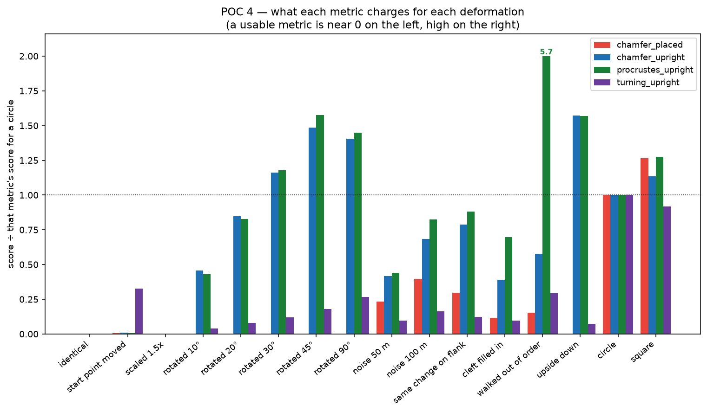
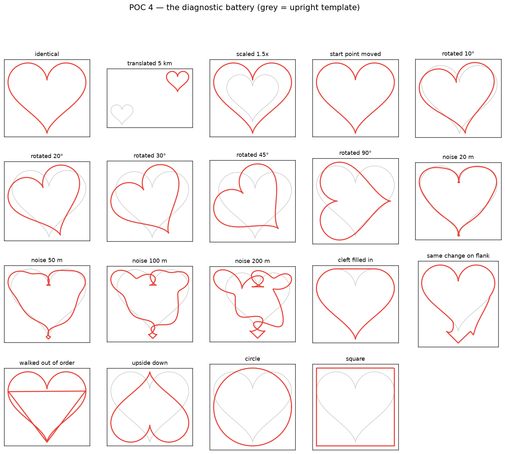
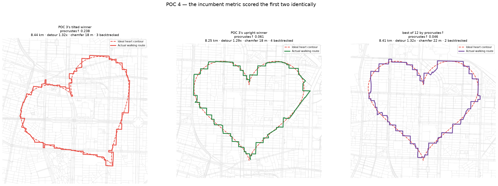

# POC 4 — Fixing the ruler

> **Two claims on this page were later overturned by POC 5** — see
> [README_POC5.md](README_POC5.md). A human rater found that tilt does **not**
> reduce heart-likeness, so the rotation sensitivity this POC builds in is an
> error and the rotation-invariant formulation it argues against is correct.
> And the ρ = −0.007 below is a restricted-range artifact: over 50 placements
> the two metrics correlate at +0.771. The battery, the traversal-order finding
> and the cleft hypothesis all survive.

POC 3 ended by catching its own search gaming its objective: a heart tilted 30°
scored identically to an upright one and looked far worse. Its recommendation
was to replace chamfer with a turning-function distance.

Both halves of that recommendation turned out to be wrong, and finding out how
is what this POC is.



## The diagnosis was wrong: the metric was fine, the *reference* was not

Reading the code rather than the write-up:

```python
metrics.update(shape_similarity(route_xy, reference_xy))   # heart_route_poc2.py
```

`reference_xy` is the ideal heart **placed and rotated to match the candidate**.
Rotate the target along with the route and the rotation cancels before any
arithmetic happens. No comparison function could have seen it. POC 3 blamed the
metric for a fault in what it was being compared against.

That reframes the fix as much cheaper than "invent a perceptual metric":
compare against a canonical **upright** template, normalising away translation
and scale (which genuinely do not affect heart-ness) but **not** rotation
(which very much does).

## The recommended metric was also wrong

POC 3 recommended a turning function because it "is not invariant to the tilt
that fooled this POC". The classic Arkin turning-function distance minimises
over the angular offset and is therefore **rotation-invariant by design** — the
exact property that needed avoiding. It can be made sensitive by not doing that
minimisation, so that variant was implemented and tested.

It failed for a different and more interesting reason. Total turning around any
simple closed curve must be exactly ±2π. Measured:

| resample n | heart | circle |
| ---: | ---: | ---: |
| 128 | −9.109 | 6.234 |
| 512 | −9.270 | 6.271 |
| 4096 | −9.370 | 6.280 |
| 16384 | −9.397 | **6.280** |

The circle converges correctly. The heart converges to −9.4 and gets **worse**
with resolution. At a cusp the tangent reverses by exactly π and the sign of
that turn is genuinely ambiguous; the accumulation picks a branch and the error
never washes out. A heart is *defined* by its two cusps, so a turning function
is the wrong tool for precisely this shape class. `shape_metrics.winding()`
keeps this as a runnable self-test.

## Four candidates, one battery

| metric | what it compares against |
| --- | --- |
| `chamfer_placed` | the incumbent: chamfer vs the placed, rotated reference |
| `chamfer_upright` | chamfer vs an upright template, translation/scale normalised |
| `procrustes_upright` | **ordered** point distance vs the same upright template, minimised over cyclic shift and direction only |
| `turning_upright` | turning-function distance, rotation-sensitive variant |

Rather than assert which is best, all four run against deformations whose
correct ordering can be stated with confidence:



| property | chamfer_placed | chamfer↑ | procrustes↑ | turning↑ |
| --- | :---: | :---: | :---: | :---: |
| translation-invariant | PASS | PASS | PASS | PASS |
| scale-invariant | PASS | PASS | PASS | PASS |
| start-point-invariant | PASS | PASS | PASS | PASS |
| penalises 30° rotation | **FAIL** | PASS | PASS | PASS |
| rotation penalty grows with angle | **FAIL** | PASS | PASS | PASS |
| noise penalty grows with amplitude | PASS | PASS | PASS | PASS |
| circle worse than noisy heart | PASS | PASS | PASS | PASS |
| square worse than noisy heart | PASS | PASS | PASS | PASS |
| upside-down heart penalised | **FAIL** | PASS | PASS | **FAIL** |
| penalises wrong traversal order | **FAIL** | **FAIL** | PASS | PASS |
| cleft costs more than equal change elsewhere | **FAIL** | **FAIL** | **FAIL** | **FAIL** |
| **passed** | 6/11 | 9/11 | **10/11** | 9/11 |

**Winner: `procrustes_upright`.**

What separated it from `chamfer_upright`, which was otherwise tied, is the
traversal-order test — walking the same heart with its quarters in the order
A-C-B-D. Chamfer is an *unordered* nearest-neighbour distance, so it charges
0.086 for this: **less than it charges for 100 m of noise**. The ordered metric
charges 1.152, more than for any other deformation in the battery. This is not
a contrived case: a route with a large out-and-back spur is a sequence error of
exactly this kind, and POC 2 established that spurs are the artifact the eye
catches first.

### Two fixes to the battery itself

The first version of the cleft test compared filling in the cleft against a
half-sine "bump" matched only on *mean* displacement. Matching two summary
statistics is weaker than matching the numbers, so the control now transplants
the **identical per-point displacement magnitudes** to an equally long arc on
the flank — the only difference between the two cases is where it lands.

The invariance checks initially failed for every upright metric at a residual
of 0.013. That was resolution, not blindness: two identical curves sampled from
different starting points land half a sample spacing apart. Raising the sampling
and checking against a computed `sampling_floor()` made all three pass.

## Does it change any real decision?

A metric that wins a synthetic battery has proved nothing until it changes an
answer.

**The rotation pitfall, re-scored:**

| route | chamfer_placed | chamfer↑ | procrustes↑ |
| --- | ---: | ---: | ---: |
| POC 3's tilted winner | 18.0 m | 0.158 | 0.238 |
| POC 3's upright winner | 18.6 m | 0.023 | 0.061 |
| **tilted ÷ upright** | **0.97×** | **6.8×** | **3.9×** |

The incumbent rated the tilted route *slightly better*. Both upright metrics
separate them decisively.

**Re-ranking 12 real placements from POC 3's search:**

```
Spearman(chamfer_placed, procrustes↑) = -0.007   (p = 0.98)
```

Essentially zero. The metric that drove every decision in POC 1–3 and the
metric that wins the battery are measuring **unrelated things** on real routes.
They pick different winners, and the one procrustes prefers has 2 backtracked
edges against the chamfer pick's 9 — while chamfer rates it 4 m *worse*.



A caveat on the mechanism: procrustes correlates +0.40 with backtracked edges
where chamfer correlates −0.11, which is the direction the traversal-order
result predicts, but at n = 12 it is **not significant** (p = 0.20). Suggestive,
not established.

## The failure all four metrics share

No candidate charges more for filling in the cleft than for an identical
displacement applied elsewhere — chamfer_upright charges roughly half as much
(0.058 vs 0.117); procrustes gets closer but still under (0.141 vs 0.179).

The mechanism is visible in the incumbent's numbers: 24.7 m for the cleft
against 62.0 m for the flank, despite both moving points 257 m on average.
Filling a **concavity** keeps the new curve near the old one, so a
nearest-neighbour distance finds the lobe peaks close by; protruding outward
moves into empty space and is measured at full magnitude. Ordered comparison
largely repairs this, which is a further argument for procrustes, but does not
eliminate it.

So every metric here measures **geometric deviation**, and the cleft is a
small-deviation, high-meaning feature. That gap is where a learned or
genuinely perceptual metric would earn its keep.

**Stated plainly: no human study was run.** The battery encodes properties any
usable metric must have; it is not evidence that a metric which has them matches
human judgement. The cleft ordering in particular is my judgement, and all four
metrics disagree with it — that disagreement is reported rather than resolved.

## Running it

```bash
pip install -r requirements.txt
python heart_route_poc4.py          # the battery: ~5 s, no network needed
python poc4_apply_to_routes.py      # real routes: needs POC 3's cached network
```

Outputs `poc4_diagnostics.png`, `poc4_metric_comparison.png`,
`poc4_route_ranking.png`. `shape_metrics.py` is the reusable part.

## Recommendation for POC 5

Adopt `procrustes_upright` as the objective and **re-run POC 3's search under
it**. That is not a formality: the two metrics correlate at ρ ≈ 0 on real
routes, so every placement decision made in POC 1–3 rests on a ruler that has
now been shown not to measure the thing anyone cares about. The search is cheap
(~4 s coarse, ~5 s per refinement) and the answer may well move.

Only then move on to the product questions (text-to-shape, image-to-shape).
Those are all searches, and a search is only as good as its score — which this
project has now demonstrated three times running: POC 2's length-only cost, POC
3's rotation blindness, POC 4's unordered comparison. Each was an objective
function that looked reasonable and quietly optimised for the wrong thing.

Two smaller follow-ups worth folding in: `procrustes_upright` is O(n²) over
cyclic shifts and should use an FFT cross-correlation before it goes anywhere
near an interactive search; and the cleft result argues for a small
human-labelled set — a few dozen route pairs ranked by eye — as the first real
validation any future metric has to pass.
