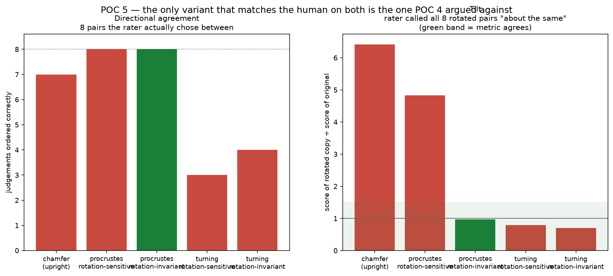

# POC 5 — Testing the ruler against a person

POC 4 chose `procrustes_upright` on a battery of synthetic deformations whose
correct answers **I asserted**. POC 5 got a person to answer instead.

The result overturns my own choice. The metric POC 4 selected is wrong in
exactly the way POC 4 argued it needed to be right.



| variant | directional | tilt ratio | verdict |
| --- | :---: | ---: | --- |
| chamfer (upright) | 7/8 | 6.41× | fails both |
| procrustes, **rotation-sensitive** (POC 4's pick) | 8/8 | 4.83× | **fails tilt** |
| procrustes, **rotation-invariant** | **8/8** | **0.96×** | **agrees with the human** |
| turning, rotation-sensitive | 3/8 | 0.80× | fails direction |
| turning, rotation-invariant | 4/8 | 0.70× | fails direction |

## What the human data says

Two labelling runs, one rater (the project owner), 37 trials.

**The cleft question is settled, and procrustes was right.** Shown a route with
its cleft flattened against the same route with an identical displacement
applied to a flank, the rater picked the flank version as more heart-like — the
notch matters more than the bulge. Only the ordered comparison agrees; chamfer
(both forms) and rotation-sensitive turning get it backwards. This resolves the
question POC 4 left open, in favour of POC 4's hypothesis and its metric.
Across both runs the ordered metric orders all 8 decisive judgements correctly.

**Tilt does not reduce heart-likeness.** Eight pairs showed the *same route*
twice with one copy rotated 20° or 40°. The rater called all eight "about the
same", by deliberate mouse click, having correctly identified the flattened-cleft
shape in both control pairs (in ~1 s each) and having answered both repeated
pairs consistently. They were discriminating; they just did not discriminate on
tilt.

That premise had never been tested, and this project asserted it three times:

- **POC 3** locked rotation to 0°, on the grounds that a tilted heart "stops
  reading as a heart" — my judgement, presented as self-evident.
- **POC 4** diagnosed the incumbent metric's blindness to tilt as *the* bug, and
  built rotation sensitivity in as the fix.
- **POC 4** further dismissed the classic Arkin turning distance because it
  "minimises over the angular offset and is therefore rotation-invariant **by
  design** — the exact property that needed avoiding."

The rater says that property was correct behaviour. Classical Procrustes
analysis removes rotation for the same reason, and my `_upright` variant was the
deviation from the textbook. **The textbook was right and I was not.**

The fix is one argument that already existed:
`procrustes_upright(..., allow_rotation=True)`. It keeps the ordered comparison
the cleft result validates, and drops the rotation sensitivity the tilt result
contradicts. It is the only variant tested that matches the human on both axes.

## What this does NOT overturn

POC 3's rotation episode was still a real finding, for a narrower reason. The
incumbent metric compared a route against a reference **rotated to match it**,
so rotation cancelled before any arithmetic — the metric was not making a
considered judgement that tilt is unimportant, it was structurally unable to
express one. That is still a defect. And POC 3 measured that allowing rotation
bought exactly nothing (17.9 m either way), so re-enabling it is a correctness
matter, not an expected improvement.

## The first run had a data-quality problem, and it was my fault

Run 1 returned 17 ties out of 25 in 47 seconds, median gap 1.2 s. I had bound
"about the same" to the spacebar **and advanced with zero delay**, where a
choice advanced after 160 ms — so a held or repeated key walks through trials.
That is a flaw in the instrument, not in the rater.

Consequently run 1's agreement rates are **not reported as a result**. With 8
non-tie judgements, 5 of them the same easy comparison, a rate of 7/8 carries a
95% interval of roughly 47–100%; `chamfer_placed` "winning" at 88% is noise, and
presenting it would be worse than presenting nothing. Run 2 removed the
shortcut, made ties a deliberate click, and recorded reaction time per trial.

## A correction to POC 4's headline number

POC 4 reported chamfer and procrustes at ρ = −0.007 over 12 placements and
concluded they "measure unrelated things". Over 50 placements here they
correlate at **+0.771**.

The earlier figure came from a **restricted range**: all 12 came from the
coarse-top shortlist, spanning procrustes 0.051–0.245, against 0.051–0.810
across the full sample. Same data, three windows:

| sample | ρ |
| --- | ---: |
| all 50 placements | **+0.771** |
| coarse-top 25 only | +0.438 |
| POC 4's 12 | −0.007 |

Both facts are true and neither alone is the story: **the metrics agree
substantially about what is bad, and stop agreeing within the narrow band of
already-good placements** — which is exactly the band where the final choice
gets made. POC 4 over-generalised from a truncated sample.

## The two-stage search survives the change of ruler

POC 3 validated its cheap stage-1 filter at ρ = +0.76 against chamfer. Since the
objective changed, that validation no longer covered anything. Re-measured over
50 placements:

| | ρ | p |
| --- | ---: | ---: |
| coarse score vs chamfer (POC 3's claim) | +0.810 | <0.0001 |
| **coarse score vs procrustes (new objective)** | **+0.606** | <0.0001 |

Weaker but clearly useful, and the coarse-selected group averages 0.084 against
random placement's 0.225. The design holds. The best placement moves 724 m, from
POC 3's 25.0544, 121.5378 to **25.0598, 121.5338**.

That search used the rotation-**sensitive** metric, so it is superseded by this
POC's own conclusion — see below.

## Honest limits

- **One rater, 8 tilt trials.** Enough to overturn an assertion that had *no*
  evidence behind it; not enough to establish that no one cares about tilt.
  A second rater would be the cheapest next check.
- Ties are the low-effort answer. The control pairs argue against pure
  disengagement — the rater broke ties in ~1 s when they saw a difference — but
  a forced choice might still reveal a weak preference.
- 20° and 40° were tested. Nothing here says a 90° heart reads fine.
- The search re-run predates this conclusion and ranks by the rotation-sensitive
  metric. It has **not** been re-run under the corrected one.

## Running it

```bash
python poc5_build_pool.py        # routes to be judged (needs POC 3's cached network)
python poc5_build_pairs.py       # pick the discriminating pairs
python poc5_build_page.py        # generate the labelling page
python poc5b_build_tilt_test.py  # the focused tilt re-test
python poc5_research.py          # re-run the search, re-validate stage 1
python poc5_analyse.py           # score every metric variant against the human data
```

## Recommendation for POC 6

1. **Adopt `procrustes_upright(allow_rotation=True)`** and rename it — `_upright`
   is now actively misleading for a metric that is rotation-invariant. It is the
   only variant matching the human on both axes.
2. **Re-run the search under it, with rotation re-enabled.** POC 3's upright
   constraint rests on a premise the data does not support, and the re-run in
   this POC used the superseded metric. This is the third time the search has to
   be re-run because the objective moved; it is cheap, and it is the price of
   having been wrong about the ruler.
3. **Get a second rater before building anything on this.** The whole chain now
   pivots on eight judgements from one person.

The pattern across five POCs is consistent enough to state plainly: **every
substantive error in this project has been in the objective function, not the
algorithm** — POC 2's length-only cost, POC 3's rotated reference, POC 4's
rotation sensitivity, and POC 4's restricted-range correlation. The algorithms
worked the first time. What repeatedly failed was my confidence about what
should be measured, and the only thing that has reliably caught it is
measurement — synthetic in POCs 2–4, and for the first time here, a person.
