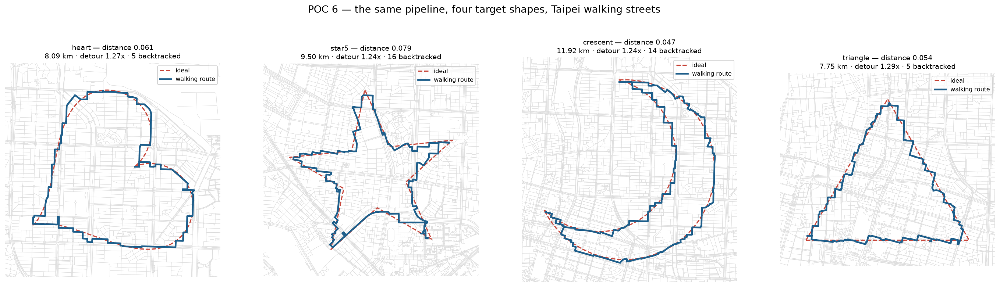
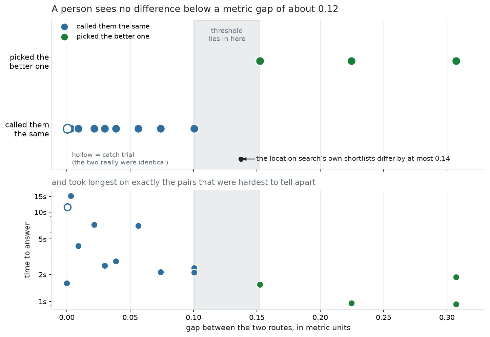

# POC 6 — Beyond hearts, and a second rater

Two things POC 5 left owing: the pipeline had only ever been run on one shape,
and its entire conclusion rested on eight judgements from one person.



## The pipeline is not a heart trick

The same code, unchanged, on four shapes chosen to stress it differently — and
all four come out recognisable.

| shape | distance | vs nearest confusable shape | ratio | backtracked | route |
| --- | ---: | --- | ---: | ---: | ---: |
| crescent | 0.047 | heart (0.540) | **0.09** | 14 | 11.92 km |
| star5 | 0.079 | heart (0.325) | 0.24 | 16 | 9.50 km |
| heart | 0.061 | triangle (0.212) | 0.29 | 5 | 8.09 km |
| triangle | 0.054 | heart (0.212) | 0.25 | 5 | 7.75 km |

Raw distances are **not** comparable across shapes — a crescent's normalised
form has far more contour per unit radius than a triangle's. The `ratio` column
is: how far the route sits from its own target, divided by how far that target
sits from the shape most easily mistaken for it. Every shape lands well under 1,
so none is close to being confusable with another. The crescent wins outright at
0.09, because it is so distinctive that even a loose fit cannot be read as
anything else.

**Detour ratio is nearly identical across all four (1.24–1.29×)**, so the street
network costs about the same in path length whatever it is drawing. What
separates the shapes is backtracking: **star and crescent need three times as
many doubled-back segments as heart and triangle** (16 and 14 against 5 and 5).
That is the price of deep concavity — a notch running into the middle of a star
has to be entered and left the same way, because Taipei has no street that
threads it.

My prediction going in was that the star would be worst and the convex triangle
easiest. Half right: the star is indeed the hardest to fit, but the triangle is
not the easiest to *recognise* — it is the shape most easily confused with
something else (0.212 from a heart), so its comfortable fit buys less.

### Rotation is searched again

POC 3 locked orientation upright; POC 5's rater found tilt does not reduce
recognisability, and POC 5's corrected metric is rotation-invariant, so tilt can
be neither penalised nor gamed. Orientation is now a free parameter and the
search uses it: the winners sit at 300° (heart), 150° (star), 150° (crescent)
and 120° (triangle). A star whose points fall along the avenues only exists if
you look for it.

### The metric got faster, not slower

Rotation alignment is free. Minimising the squared distance over the angle turns
the cross-correlation's real part into its magnitude:

```
min_θ Σ|a_i − e^{iθ}·b_{i+k}|²  =  Σ|a|² + Σ|b|² − 2·|Σ a_i·conj(b_{i+k})|
```

so one FFT still serves every cyclic shift *and* every rotation — 0.81 ms per
call. `shape_metrics.shape_distance()` is the endorsed metric; rotation
invariance is exact (a heart rotated 30°, 90° or 180° scores 0.00000 against
itself), the diagonal of the cross-shape matrix is zero, and the off-diagonal
ordering is sensible.

## The second-rater task

**https://claude.ai/code/artifact/a9416012-ed04-4540-a7c0-df4d40a72317**

14 trials, about 3 minutes. It asks two questions and nothing else:

- **Tilt (10 trials)** — the same route shown twice, one copy rotated 20° or
  40°, across all four shapes. This is the direct replication of the finding
  that reversed POC 3 and POC 4.
- **Feature (2 trials)** — a shape with its defining feature flattened (the
  heart's cleft, one of the star's notches) against the *same* route with
  **identical per-point displacements** applied a quarter-turn away. Only the
  location of the deformation differs.

Plus 2 anchors with known answers and 2 repeats for self-consistency.

Design notes carried over from POC 5's mistakes: no ideal contour is drawn (with
a target on screen the judgement becomes "does it hug the line"), no street
background, "about the same" is a deliberate click with no keyboard shortcut,
reaction time is recorded per trial, and baseline routes are shown **upright** —
un-rotated by their placement angle, since a tilt question whose untilted member
already sits at 300° tests nothing.

The page asks for a name and namespaces every answer by it, so several people
can share one link without overwriting each other.

**Constraint worth knowing before you recruit:** an artifact declaring the `db`
capability is organisation-internal and cannot be shared publicly. A rater
outside your Claude organisation will not be able to open it — in that case the
page still works and shows a copyable JSON blob at the end, which they can send
back by any route.

## Rater 2 replicated rater 1 exactly

| | rater 1 (POC 5) | rater 2 (POC 6) |
| --- | --- | --- |
| tilt pairs called "about the same" | 8 / 8 | **10 / 10** |
| defining feature worse than equal change elsewhere | 1 / 1 (heart) | **2 / 2** (heart + star) |
| anchors correct | 2 / 2 | 2 / 2 |
| repeats self-consistent | 2 / 2 | 2 / 2 |

Rater 2's tilt judgements took a median of 1.6 s and their anchors 0.9–1.3 s, so
they were looking, not clicking through. **18 rotated-vs-upright pairs across
four shapes, two independent people, every one "about the same."** POC 5's
reversal of POC 3 and POC 4 holds.

The feature result now generalises past the heart: flattening one of the star's
notches was judged worse than an identical displacement applied a quarter-turn
away, which is the same answer the heart's cleft gave. The ordered comparison
POC 4 argued for keeps earning its place; the rotation sensitivity it also
argued for stays dead.

## The third rater gets a different question

Asking a third person about tilt would buy almost nothing after that. The
untested question is the one the metric is actually **used** for.

Every human judgement so far has been about tilt (ties) or a destroyed feature
(obvious). **Nobody has been asked to rank two real routes of differing
quality** — which is the only thing the location search does with the metric.
POC 6's shortlists spanned distances of just 0.046 to 0.17. If a person cannot
see a gap that size, the search's fine-grained ranking is optimising something
invisible, and effort past a recognisability threshold belongs to route length,
safety or scenery instead.

So the third task measures a **discrimination threshold**: how large a metric
gap has to be before a person can see it. The best real heart route is degraded
with smooth low-frequency noise at rising amplitudes, producing rungs of exactly
known distance (0.061 clean, up to 0.365), and pairs are drawn at target gaps
weighted heavily toward the small end — 0.009, 0.022, 0.030, 0.039, 0.056,
0.074, 0.101, 0.152, 0.225, 0.307. Three **catch trials** pair rungs of equal
amplitude: a rater who calls those different is guessing, which sets the floor
for reading everything else.

**Third-rater task: https://claude.ai/code/artifact/35cf7aea-5f5d-4e9c-bcba-aa11dd16e4be**

15 trials, about 3 minutes. The instructions say plainly that seeing no
difference is a real answer rather than a failure, since the whole measurement
depends on ties being reported honestly.

## Rater 3: the metric's differences are mostly invisible



The result is unusually clean. **Every gap up to 0.10 was called "about the
same"; every gap from 0.15 up was answered correctly.** No trial fell in
between, so the threshold is bracketed at **0.10–0.15**.

| evidence | value |
| --- | --- |
| largest gap called "the same" | 0.1005 |
| smallest gap answered correctly | 0.1523 |
| catch trials (identical quality) called "the same" | 2 / 3 |
| repeats self-consistent | 2 / 2 |

Reaction time carries the same story independently: the near-identical pairs
took 4–15 s, the obvious ones under 2 s. That rising-difficulty-rising-latency
signature is what an engaged discrimination looks like, and it cannot be faked
by clicking through.

The one failed catch trial is informative rather than damaging. On a pair whose
true gap was 0.0004 the rater deliberated 11.4 s and then **picked a side**.
They guess when they cannot tell, so "about the same" is not their lazy default
— which makes the seven tied gap trials more credible, not less.

### What that means for the search

The location search's own shortlists, re-measured across all four shapes:

| shape | shortlist spread | vs threshold |
| --- | ---: | --- |
| crescent | 0.037 | entirely invisible |
| heart | 0.069 | entirely invisible |
| star5 | 0.134 | best-vs-worst only just visible |
| triangle | 0.137 | best-vs-worst only just visible |

**Picking the best of eight shortlisted placements instead of the worst is,
for a heart or a crescent, a difference no one can see.** For the star and
triangle it is borderline at the extremes and invisible for every pair in
between.

So stage 2's fine-grained ranking is mostly optimising something imperceptible.
What earns its keep is stage 1 — the cheap filter that throws away the bad 80%,
where the gaps are 0.2–0.8 and obvious. POC 3 measured stage 1 as "an excellent
rejector and only a mediocre ranker" and treated the second half as a weakness.
It turns out not to matter: **the ranking does not need to be good, because
nobody can see it either.**

Past the threshold, effort belongs to things a walker actually notices — route
length, road safety, whether it goes past anything worth seeing — not to the
third decimal place of a shape metric.

### The rater's feedback exposed a flaw in the instrument

After finishing, rater 3 reported that on some pairs **both routes looked unlike
a heart**, and with only "left / right / about the same" on offer they had to
answer "about the same". That conflates two unrelated things:

| what they meant | what it means for the measurement |
| --- | --- |
| "both are fine and I cannot separate them" | below the discrimination threshold |
| "both are ruined, neither is a heart" | past the **recognisability ceiling** |

My design could not tell them apart. It is the third flaw this project has
shipped in a labelling page, after POC 5's zero-delay spacebar and its
bottom-tip control.

**Re-analysed conservatively, the bracket survives.** The flaw can only
manufacture false *ties*, never false *correct answers*, so it can push the
lower bound down but never the upper bound up. Dropping every tie where neither
route was a clean heart removes four trials — g02 (0.365 vs 0.368), g03, g05 and
g07 — and all four sat at gaps of 0.003–0.056, **below the bracket's lower bound
anyway**. The endpoints are untouched:

- **Lower bound 0.1005** comes from the clean route against a degraded one, so
  "both looked bad" cannot apply — and it was answered the same way twice.
- **Upper bound 0.1523** is a correct choice, which a missing option cannot fake.

What genuinely weakens is the supporting density (5 clean sub-threshold ties
instead of 8) and the catch-trial validation: the two ruined-pair catches are now
uninterpretable, and the rater answered them inconsistently — a tie on one, a
pick on the other — which is what noise in a saturated region looks like.

The feedback also surfaced something the design missed conceptually:
**recognisability almost certainly saturates.** Past some distance everything is
"not a heart" and further degradation stops mattering. The ladder assumed a
single monotonic scale with no ceiling, and a ceiling is a product question in
its own right — it is where "too bad to ship" begins.

### Version 2 fixes both known flaws

**https://claude.ai/code/artifact/80beefad-20cb-433b-83a9-f7ba7a653e36**

14 trials. Three changes:

1. **Four responses**: "both look like it, can't separate them" and "neither
   looks like it" are now distinct, so a tie never stands in for a floor effect —
   and the "neither" answers locate the ceiling.
2. **Every comparison is anchored to the clean route.** One side is always the
   undegraded heart, which makes "both are ruined" structurally impossible on the
   trials that define the threshold.
3. **Dense sampling across 0.10–0.17** — the interval version 1 bracketed but
   never sampled, which was the limitation I owned last round. Gaps now run
   0.015, 0.049, 0.074, **0.098, 0.110, 0.120, 0.131, 0.150, 0.168**, 0.220, 0.299.

One more bug worth recording: v2 shipped **blank** on its first build. The page
is generated by patching a template as text, and one replacement targeted
`el.tie = ...` where the source says `tie: ...` inside an object literal. It
silently matched nothing, `el.neither` stayed undefined, and the exception
aborted the script before it painted. Every replacement is now routed through a
helper that raises if it does not match — a silent no-op is the characteristic
failure of patching code as text.

### Limits specific to this measurement

- **One rater, 12 gap trials.** A single-subject psychophysics run.
- **The bracket is not resolved.** My target gaps jumped from 0.100 to 0.150,
  so nothing was sampled where the threshold actually sits. Version 2 above
  fixes this.
- **No ceiling was measured.** The instrument could not ask where a shape stops
  being recognisable at all. Version 2 can.
- **The ladder is synthetic.** Rungs were made by adding smooth noise to one
  real route, which degrades it uniformly. Real alternative placements differ in
  structured ways instead — a spur here, a staircase there — and those may be
  more or less noticeable than uniform wobble at the same metric distance.

## Limits

- Four shapes, one city. Nothing here says this survives a shape with a hole in
  it, disconnected parts, or fine detail at street scale.
- The width is fixed at 2 km for every shape, which flatters the crescent (long
  perimeter, so more contour per metre of error) and penalises nothing in
  particular. Searching scale still needs a scale-invariant objective.
- The star's 16 backtracked segments are a real artifact, not a rounding error;
  at a glance the route reads as a star, but a walker would notice re-walking
  the same alleys.
- POC 5's search re-run used the superseded rotation-sensitive metric. POC 6's
  search uses the corrected one, so the two are not directly comparable.

## Recommendation for POC 7

Tilt replicated, so the metric question is closed. The threshold result then
answers the question that had been driving five POCs of metric work — **how good
does the metric need to be?** — with: *good enough to reject the bad 80%, and no
better.* Five POCs were spent refining a ruler whose last two decimal places
nobody can read.

That reframes what is left:

1. **Stop tuning the objective.** `shape_distance` clears the bar. Fine-ranking
   inside a shortlist optimises below the threshold of perception.
2. **Add a second objective past the threshold.** Once a placement is
   recognisable, rank on something a walker perceives — total distance, how much
   of the route is on quiet streets, whether it passes a park. That is a
   genuinely new axis, not more of the same.
3. **Then shape acquisition** — text-to-shape or image-to-shape. The pipeline is
   already shape-agnostic: it takes any ordered closed contour and returns a
   route, so the interface is exactly that.

The concavity cost stands apart from all of it, and is the one finding no metric
argument can touch: deep notches need backtracking, because no street threads
them. That is the street network's answer, not the objective function's.
