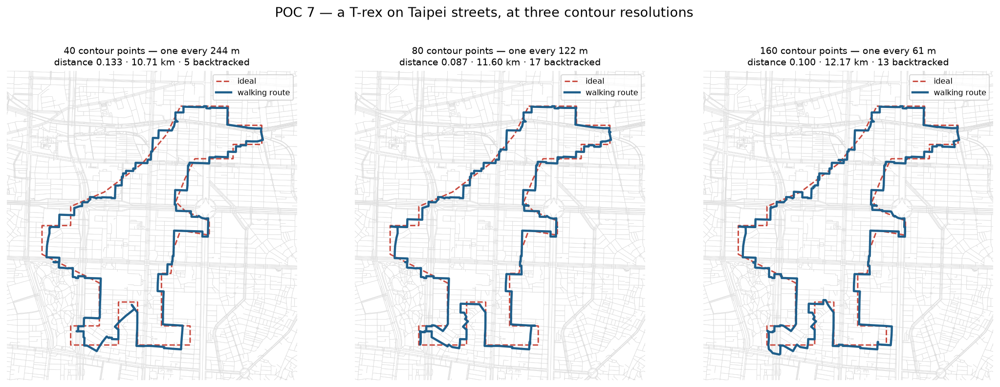

# POC 7 — A dinosaur, and three limits it exposed

You asked whether a more complex shape — Chrome's offline dinosaur — would make
the threshold measurement more accurate. It would not: that uncertainty is
methodological (one non-independent rater, the anchoring confound, an unmeasured
ceiling), and a new stimulus changes none of it.

It was worth doing for a different reason. A T-rex has concave features at very
different scales, and it reached three limits four simple shapes never did — one
of which **corrects a POC 6 conclusion**.



**The dinosaur works.** At its best it scores 0.073, between the heart (0.061)
and the star (0.078). A recognisable T-rex is walkable on Taipei streets.

## Limit 1 — topology, not resolution

The real sprite has an eye, and an eye is a **hole**. Every stage of this
pipeline — the contour sampler, the placement, the Viterbi matcher, the metric —
assumes a single closed curve. A shape with a hole cannot be drawn badly; it
**cannot be expressed at all**.

That matters more than it sounds for the product. It rules out, at minimum:
letters with counters (A, B, D, O, P, R), most logos, and any figure with a
separate part. Supporting them means multi-contour routes, which means deciding
how a walker gets from one closed loop to another — a product question ("two
separate walks? one walk with a marked gap?") before it is an algorithmic one.

## Limit 2 — the contour sampler, not the streets

Measured on this network: random points sit a median of **8 m** from the nearest
street, so the street grid can render features down to roughly **50 m**. The gap
between the dinosaur's legs is ~160 m at 2 km wide — comfortably renderable.

But POC 6 used 40 contour points for *every* shape, and perimeters differ, so
that was never the same sampling density:

| shape | perimeter | spacing at n=40, 2 km wide | n for the heart's density |
| --- | ---: | ---: | ---: |
| triangle | 3.00 | 150 m | 38 |
| heart | 3.19 | 160 m | 40 |
| star5 | 3.82 | 191 m | 48 |
| crescent | 4.79 | 240 m | 60 |
| trex | 4.88 | 244 m | 61 |

A sampler taking one point every 244 m cannot see a 160 m leg gap. **For complex
shapes the bottleneck is the sampler, not the street network** — and POC 6's
convention quietly penalised its most complex shapes.

### There is an optimal sampling density, and it is a property of the city

Same placement, varying contour resolution:

| n | spacing at 2 km | distance | backtracked |
| ---: | ---: | ---: | ---: |
| 40 | 244 m | 0.133 | 5 |
| **61** | **160 m** | **0.073** | 11 |
| 80 | 122 m | 0.087 | 17 |
| 120 | 81 m | 0.095 | 19 |
| 160 | 61 m | 0.100 | 13 |

Non-monotonic, with an optimum near **160 m** — and backtracking climbing
steadily as sampling gets finer (5 → 11 → 17 → 19). Past the optimum, extra
contour points are extra constraints the street grid cannot satisfy, so the
matcher buys them with detours.

160 m is also the heart's spacing at POC 1's n=40, which was tuned by hand on a
heart. The convergence suggests the right rule is not a point count at all:
**sample the contour at the characteristic scale of the street grid**, which is
a property of the city, not of the shape. In another city that number changes.

## Limit 3 — this corrects POC 6

Re-running POC 6's four shapes at matched sampling density:

| shape | POC 6 (n=40) | matched density | change |
| --- | --- | --- | --- |
| heart | 0.061, 5 backtracked | n=40 → 0.061, 5 | unchanged |
| star5 | 0.079, 16 backtracked | n=48 → 0.078, **20** | worse |
| crescent | 0.047, 14 backtracked | n=60 → 0.048, **6** | **backtracking more than halved** |
| triangle | 0.054, 5 backtracked | n=38 → 0.063, 7 | slightly worse |

POC 6 concluded that "star and crescent need three times as many doubled-back
segments as heart and triangle — that is the price of deep concavity," and
called it the one finding no metric argument could touch.

**Half of it was my sampling convention.** At matched density the crescent needs
6, right alongside the heart's 5. Only the star genuinely pays the concavity
cost, and it pays more than I reported (20, not 16). The corrected statement:
*a shape pays for concavity when the notch is narrow relative to the street
grid* — the star's notches are; the crescent's single broad bite is not.

## The metric under-weights a destroyed feature, again

At n=40 the dinosaur's legs merge into one blob. What that costs:

| n | mean deviation | worst local deviation | where |
| ---: | ---: | ---: | --- |
| 40 | 24 m | **124 m** | 56% around the contour — **inside the legs (44–66%)** |
| 61 | 18 m | 75 m | 63% |
| 80 | 18 m | 76 m | 45% |
| 160 | 16 m | 65 m | 80% |

The mean barely moves (24 → 18 m) while the worst local error halves, and at
n=40 it sits squarely in the legs. In metric terms n=40 scores 0.133 against
0.073 — a gap of 0.060, **below the ~0.10 threshold at which a person reliably
sees a difference**.

So the metric, and probably a glancing viewer, would call the legless version
"not much worse" while a defining feature is gone. This is exactly POC 4's cleft
finding and POC 5's confirmation of it, reappearing at a larger scale — and it
gets *worse* for complex shapes, because complex shapes have more defining
features to lose.

## What this says about your question

A complex shape does not sharpen the threshold. It does something more useful:
it is where **the metric and the eye come apart**, because it has features whose
destruction costs little on average. Four simple shapes could not show that.

So the dinosaur is good material for a *later* rater round — but for the
question "does the metric notice when a defining feature dies?", not "where is
the threshold?". And that round still needs the fixes POC 6 left owing: a fresh
rater, unanchored pairs, and the four-option response together.

## Limits

- One authored silhouette, not the real sprite (which is copyrighted, and whose
  eye could not be represented anyway). The proportions are mine.
- The 160 m optimum is one shape, one city, one placement. It coincides with the
  heart's hand-tuned value, which is suggestive, not established.
- The leg-merging claim rests on the deviation profile and on looking at the
  plot. No rater has judged it.

## Running it

```bash
python poc7_trex.py      # placement search, resolution sweep, matched-density re-run
```
