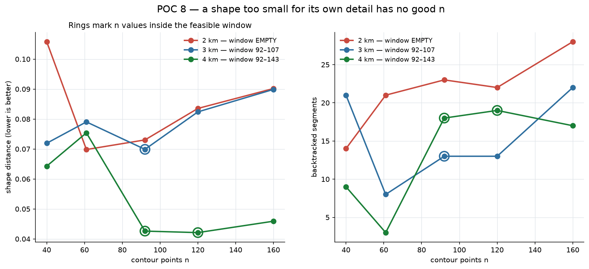

# POC 8 — Choosing n, and what shape complexity costs in kilometres

You were right that different shapes need different `n`, and asked how to decide
it. There is a computable answer, and working it out turned up something more
useful than a tuning rule: **shape complexity sets a floor on how far you have
to walk.**

## The dinosaur, traced rather than drawn

POC 7 used a hand-authored silhouette. This traces the real sprite: threshold
the dark pixels, take the largest connected component (dropping the cactus and
the ground dashes), fill holes, and simplify the 0.5 contour to 58 vertices —
which changes the enclosed area by **0.19%**, so it is the sprite's outline, not
an impression of it.

Filling the holes removed exactly one: a **13×12 px eye**, 0.85% of the area and
6.4% of the width. At a 2 km target that is 128 m across — comfortably above the
~50 m this street network resolves. **It is not too small to draw. It is not
drawable**, because every stage here takes one closed curve and an eye is a
second one. POC 7's topology limit, now with a number on it.

## Two costs meet, and n sits between them



POC 7 left a puzzle: sweeping the T-rex's contour resolution gave a
**non-monotonic** curve, best at 61 points and worse either side. More detail
made the drawing worse, which should not happen.

It happens because two costs pull opposite ways.

**Sampling loss falls as n rises.** An n-point polygon is a lossy version of the
shape, and how lossy is measurable in milliseconds with no map involved:
`shape_distance(n-point polygon, dense contour)`. The shapes separate sharply:

| n | heart | star5 | crescent | triangle | **trex** |
| ---: | ---: | ---: | ---: | ---: | ---: |
| 16 | 0.021 | 0.103 | 0.032 | 0.046 | **0.233** |
| 40 | 0.004 | 0.000 | 0.008 | 0.018 | **0.080** |
| 80 | 0.001 | 0.000 | 0.007 | 0.009 | **0.061** |
| 160 | 0.000 | 0.000 | 0.004 | 0.004 | **0.025** |

A heart is under 0.02 by n=16. The T-rex is still at 0.025 by n=160 — an order
of magnitude more demanding, which is your intuition made into a number.
(The star's exact zeros are an artifact: n=40 is a multiple of its 10 vertices,
so the polygon reproduces it exactly.)

**Street-fitting cost rises as n rises.** Past the street grid's own scale —
~160 m here, measured in POC 7 — every extra contour point is a constraint the
grid cannot satisfy, and the matcher buys it with detours.

So n has a window:

```
n ≥ n_min(shape)                  enough points to represent the shape
n ≤ perimeter_metres / 160 m      one point per street scale
```

And the window can be **empty** — which is a statement about size, not about n:

```
W ≥ n_min × 160 m / perimeter_normalised
```

### The prediction, and what actually happened

The T-rex at 2 km needs n ≥ 92 to represent but allows at most 72. Empty — every
n is a compromise, which is exactly POC 7's non-monotonic sweep. Prediction:
draw it bigger and a real optimum appears inside the window.

| width | window | best n | best distance | route |
| --- | --- | ---: | ---: | ---: |
| 2 km | **empty** | 61 *(outside)* | 0.070 | 12.3 km |
| 3 km | 92–107 | **92** *(inside)* | 0.070 | 19.4 km |
| 4 km | 92–143 | **120** *(inside)* | **0.042** | 27.9 km |

**The window predicts the optimum wherever it is non-empty** — at 3 km and 4 km
the best n lands inside it, and at 4 km the two in-window values (0.043, 0.042)
are clearly the best on the curve while the out-of-window ones sit at 0.064 and
0.075.

Two things did **not** go as predicted, and both matter:

- **3 km bought nothing.** The distance stayed at 0.070. Only at 4 km did it
  drop, by 40%. So "minimum drawable width 2.6 km" was optimistic; the real
  improvement needed 4 km.
- **Non-monotonicity never went away.** It is present at every size. But the
  spread within the window is small compared with the ~0.10 threshold at which a
  person reliably sees a difference, so the window tells you where to look and
  the exact choice inside it barely matters.

### A wrong turn worth recording

My first attempt measured complexity as the shape's **narrowest self-approach** —
the closest two points that are far apart along the contour. It declared every
shape, including the heart and triangle, undrawable at 2 km, which they
demonstrably are not. The measure was picking up **cusps**: at the heart's
bottom tip the two sides converge to nothing, and that registers as an
infinitely narrow feature. But a cusp does not need resolving as a gap — the
route simply goes down and comes back. Sampling loss, measured with the metric
that was already validated against people, has no such failure mode.

## What complexity costs in kilometres

This is the part worth carrying into the product:

| shape | n floor | minimum width | walk at that width |
| --- | ---: | ---: | ---: |
| crescent | 12 | 0.4 km | **2.5 km** |
| heart | 12 | 0.6 km | **2.5 km** |
| triangle | 12 | 0.6 km | **2.3 km** |
| star5 | 36 | 1.5 km | **7.5 km** |
| **trex** | 92 | 2.6 km | **19.1 km** |

A heart is an after-dinner stroll. A five-pointed star is a proper 7 km walk. **A
recognisable dinosaur is a half-marathon, and cannot be made shorter without
ceasing to look like a dinosaur.** Measured, not estimated: the T-rex runs
11–14 km at 2 km wide, 17–20 km at 3 km, and 23–29 km at 4 km.

That is a product constraint, not an engineering one. "Draw me a dinosaur route
near my flat" has no good answer if the user wants a 5 km walk, and the honest
UI response is to say so up front — offer the shapes that fit the distance
someone asked for, rather than returning an unrecognisable dinosaur.

## Limits

- `n_min` depends on the tolerance chosen for sampling loss (0.05 here, half the
  measured perceptual threshold). A looser tolerance shortens every minimum
  width proportionally.
- The 160 m street scale is one city, from one measurement in POC 7.
- The size sweep is one shape at three sizes, one placement each. The 4 km
  improvement is a single measurement.
- Walk lengths assume the detour ratio of ~1.30 that every shape has shown so
  far; that has been stable across five shapes but is not guaranteed.

## Running it

```bash
python poc8_sizing.py      # sampling-loss curves, n windows, the size sweep
```
