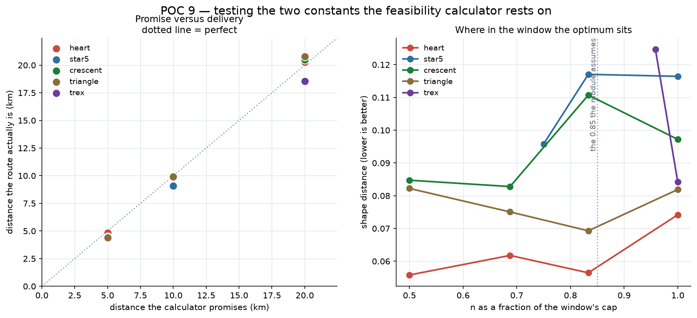

# POC 9 — The feasibility mechanism

POC 8 found that shape complexity sets a floor on walking distance. This turns
that into a component, and tests the two constants it rests on.

**Try it: https://claude.ai/code/artifact/33e0ab38-6982-49f2-bc0b-95a2f789115c**

## The mechanism collapses to two numbers

```
W_min = n_min × s / P                       smallest width with a non-empty n-window
D     = P × W × detour                      the walk a shape of width W produces
D_min = P × W_min × detour = n_min × s × detour
```

**The perimeter cancels.** A shape's minimum walkable distance depends only on
how many contour points it needs, the street grid's scale, and the detour the
network imposes — not on how long its outline is. The same cancellation happens
in the other direction:

```
cap(D) = D / (s × detour)                   contour points a walk of D affords
```

which is also shape-independent. So feasibility is a budget against a cost, in
one shared unit:

> **A walk of D kilometres buys `cap(D)` contour points. A shape costs `n_min`.
> It fits if the cost is under the budget.**

That is the whole mechanism: **one integer per shape** (computed offline in
milliseconds, no map) and **one number per city**.

| shape | n_min | minimum walk |
| --- | ---: | ---: |
| crescent · heart · triangle | 12 | **2.4 km** |
| star5 | 36 | **7.2 km** |
| trex | 92 | **18.4 km** |

## Testing the constants

`route_feasibility` rested on a street scale of 160 m (POC 7) and a detour ratio
of 1.30 that had never been tested outside 2 km-wide shapes. Twelve fits across
five shapes and three target distances:

**The detour ratio is not a constant.**

| | measured detour |
| --- | --- |
| overall | **1.252** (sd 0.068, range 1.14–1.35) |
| by target distance | 1.19 at 5 km → 1.26 at 10 km → 1.28 at 20 km |
| by shape | star 1.19 · trex 1.21 · crescent 1.26 · triangle 1.26 · heart 1.29 |

So 1.30 systematically over-promised. It is now 1.25, the measured mean. The
size trend is partly confounded: a shape 5 km wide has far fewer placements to
choose from inside a 9 km network than a 1 km one, so some of the rise may be
the search running out of room rather than geometry.

**Against the promised distance**, the routes landed:

| within | of 12 fits |
| --- | --- |
| ±5% | 7 |
| ±10% | 10 |
| ±15% | **12** |

So the page quotes a **range, not a number**. Promising "10.0 km" and delivering
8.8 km is exactly the kind of quiet inaccuracy this project keeps catching in its
own metrics; there is no reason to ship one deliberately.

Lowering the constant to 1.25 widens every shape by 4%, which should shift the
errors positive by about the same — **inferred, not re-measured**: the fits were
run at the old widths and have not been repeated.

**Where inside the n-window to sit does not matter.** The module assumed 0.85 of
the cap, fitted to two measurements of one shape. Swept across five shapes, the
optimum sits at 0.50, 0.69, 0.75, 0.83 and 1.00 — no single fraction is right.
But the *entire sweep* spans only 0.013–0.041 in shape distance for every shape,
far below the ~0.10 at which a person sees a difference. The position is both
unpredictable and immaterial; the constant is now 0.75, the measured mean, and
the code says why it does not matter.



## What the page does, and why it is built this way

Three decisions, each of which follows from an earlier finding rather than from
taste:

**It asks for distance first.** Distance is the user's real constraint — an
hour free, a 5K, a long Sunday. Shape is the variable. Asking the other way
round leads to a refusal after the user has already chosen.

**A refusal carries the number.** Not a greyed-out card but "細節太多，8.0 km 走
不出來 —— 它至少需要 18.4 km". A user who wanted a dinosaur can then decide
whether they want it enough to walk 18 km.

**The check happens before anything is drawn.** This is the important one. POC 7
showed that merging the dinosaur's legs — destroying a defining feature — costs
only 0.060 in metric terms, below the threshold at which anyone notices.
**The system cannot detect its own degraded output.** So the guard has to be a
prior feasibility check, not a posterior quality check. Every quality gate this
project has built would have passed that legless dinosaur.

The page shows cost against budget as a meter per shape, so the constraint reads
as a property of the shape rather than as an arbitrary refusal.

## Limits

- The detour ratio is one city and 12 fits, with a size trend that may be a
  search-space artifact.
- Lowering it to 1.25 has not been re-validated at the new widths.
- `n_min` depends on the sampling tolerance (0.05, half the measured perceptual
  threshold). A looser tolerance lowers every floor proportionally.
- The street scale of 160 m comes from a single measurement in POC 7.

## Running it

```bash
python poc9_validate.py     # the 12 fits and the window sweep
python poc9_build_page.py   # regenerate the page from the module
```

`route_feasibility.py` is the reusable part — `plan(shape, target_km)` returns a
width, a contour resolution, a predicted range, and a reason.

## Deferred

Recorded in [BACKLOG.md](BACKLOG.md): multi-contour shapes (which block
text-to-shape, since `A B D O P Q R` all have counters), whether these routes are
actually walkable in reality, the unmeasured recognisability ceiling, and a rater
round on feature destruction.
